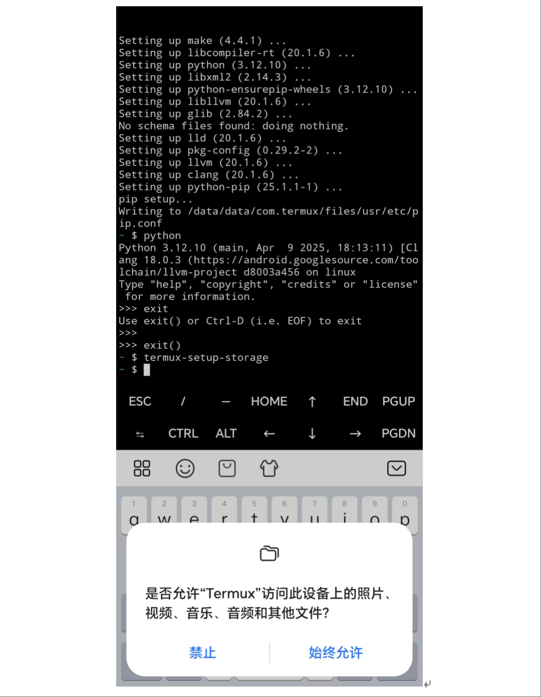
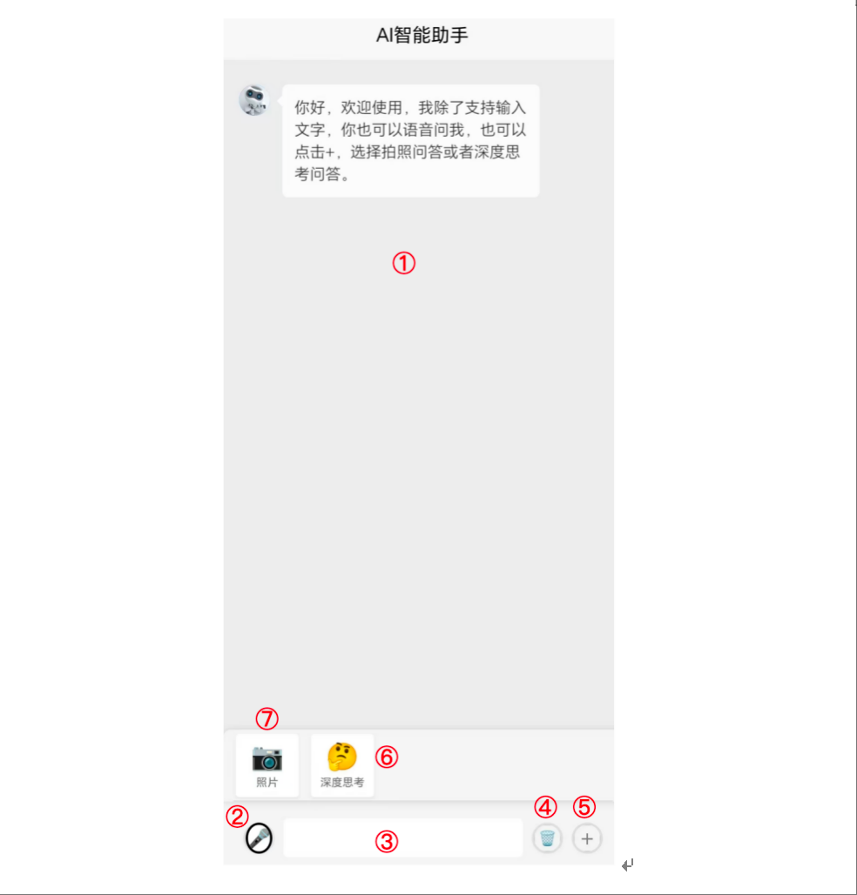

# my-awesome-device-llm-project

本项目旨在构造一个手机、平台等端侧设备本地运行多模态大模型能力的生态，包括运行环境、端侧大模型和前后端APP等，并追踪当前端侧大模型开源模型，尽微薄之力为端侧大模型应用提供一些开源实现参考。

## 环境搭建（Android）

**1. 安装termux**

直接运行安装程序termux-arm64-v8a.apk，按照系统提示直接安装即可，安装中可能由于本安装包不是官网应用市场中的，可能会有安全提示，直接允许即可。

termux安装包去官网下载或[网盘下载，提取码：enhj](https://pan.baidu.com/s/1pdcgpmOvTB3nd5I11PIIiA)

**2. 打开APP**

termux安装好后，直接打开APP，会出现命令行工具，接下来就可以跟linux一样输入命令操作了。


**3. 安装API工具**

在termux命令行工具中输入命令为：

```bash
pkg install termux-api
```

注：有时候由于网络问题，安装失败，可以多次尝试，如果还不行可以上网查下把pkg的源设为国内镜像

**4. 获取本地存储访问权限**

方便导入和操作文件，在termux命令行工具中输入命令为：

```bash
termux-setup-storage
```

执行命令后，屏幕下方会弹出如下对话框，选择始终允许


**5. 拷贝环境包**

首先将环境包放在手机目录的Download或者其他能访问到的目录，然后执行如下命令，将环境包拷贝到Termux中。环境包下载地址是：[网盘下载，提取码：qhca](https://pan.baidu.com/s/1aTx82w3qtiwjc-nJ_F4aRQ)

```bash
cp storage/Download/termux-backup.tar.gz ~/
```

**6. 直接解压安装**

```bash
tar -xzvf termux-backup.tar.gz -C /data/data/com.termux/files --recursive-unlink --preserve-permissions
```

至此，大模型运行依赖的环境就安装好了

## 模型部署

**1. 获取源代码**

获取本工程源代码，并下载模型文件，放在models中，下载地址是：[网盘下载，提取码：d6rc](https://pan.baidu.com/s/1Tf2d_lZFOoU7wO4x4iWdJQ)

**2. 运行**

将代码放在Termux能访问到的任意一个文件夹即可，进入到代码目录，执行：

```bash
python run.py
```

执行命令后，稍等一会，出现如下界面，表示服务启动成功


## APP部署和使用

直接下载APP点击安装即可，下载地址：[网盘下载，提取码：m2a2](https://pan.baidu.com/s/16Fpg4dAIbMiZk0SlndDrHA)

界面如下所示：



界面主要功能介绍：

**①对话展示区**

**②语音输入功能按钮，点击后区域③变成语音操控，按住语音操控即可开始实时语音录入**

**③文字输入区，在此处输入你想要问的问题**

**④清空按钮，点击会清空当前聊天记录，新建一个对话**

**⑤点击会出现⑦⑧功能展示区**

**⑥深度思考或标准模式切换功能**

**⑦拍照问答，待开发上线**

## 开源端侧大模型跟踪和评测对比

**1. 语言大模型**

根据实际测试，在手机上能够流畅运行的语言大模型硬盘占用在3G以下最合适。

为了评估端侧大模型效果，精选20道题端侧应用场景题为基准测试集，并提出一种主观打分机制，以Qwen3-4B-Q4_K_M.gguf为基准对比模型，基准得分为10分，然后进行二选一主观打分，若胜出+1。如果新对比模型得分超过基准模型，则新的模型成为基准模型，也就是本工程提供的下载地址模型（最佳推荐模型，最高分）。

**gemma-3-270m-it 2025-08-15**
   
    谷歌最新推出的Gemma 3 270M模型是一款轻量级AI模型，特点是仅需0.5GB内存即可在本地设备（如手机）上运行，经过6万亿个token的训练，支持聊天、编程和数学任务，性能高效。结合Dynamic GGUF技术，模型推理速度可达每秒50个token，同时支持通过Unsloth进行微调并导出到手机等设备，极大地降低了AI部署的硬件门槛。

**Qwen3-4B-2507 2025-08-06**
   
    Qwen3-4B 2507相比4月底发布的融合模型，将推理和非推理模式进行了分离，推理和非推理能力相比前代模型都有较大提升。

**Hunyuan-4B 2025-08-04**

    Hunyuan-4B是腾讯全链路自研的轻量级大语言模型，基于Transformer架构并采用多阶段训练策略构建。其核心技术包括分组查询注意力（GQA）和量化优化技术，支持快思考（Fast Thinking）与慢思考（Slow Thinking）双模式，前者通过轻量量化实现毫秒级响应，后者通过多步推理提升复杂任务精度。模型原生支持 256K 超长上下文窗口，结合旋转位置嵌入（RoPE）技术，可高效处理长文本分析与生成任务。

**Qwen3-4B 2025-04-29**

    Qwen3-4B 是 Qwen3 系列中的一员，采用与 Qwen2.5 类似架构，运用分组查询注意力（GQA）、SwiGLU、旋转位置嵌入（RoPE）和 RMSNorm 等技术，并引入 QK-Norm 确保稳定训练。其核心创新在于将推理模式和非推理模式集成，推理模式用于复杂逻辑推理、数学和编码任务，非推理模式用于高效通用对话，能依任务需求动态分配计算资源，在不同场景发挥最佳性能。推理与非推理切换方式为在指令中加入 /think和 /no_think

模型评测结果如下（按照得分排序，待整理好后，测试结果予以开源）：

模型名称| 参数量 |量化尺度 | 发布时间 | 发布机构 | 能力域 | 得分  
-|-|-|-|-|-|-
gemma-3-270m-it-GGUF | 270M | bf16 | 2025-08-15 | Google | 非推理 | 待测试
Qwen3-4B-Instruct-2507-Q4_K_M.gguf | 4B | Q4 | 2025-08-06 | Qwen | 非推理 | 待测试
Hunyuan-4B-Instruct-Q4_K_M.gguf | 4B | Q4 | 2025-08-04 | Tencent | 通用推理与非推理融合 | 待测试
Qwen3-4B-Q4_K_M.gguf | 4B | Q4 | 2025-04-29 | Qwen | 通用推理与非推理融合 | 10


**2. 语音识别大模型**

根据实际测试，在手机上能够流畅运行的语音识别大模型硬盘占用在150M以下最合适。

模型名称| 参数量 |量化尺度 | 发布时间 | 发布机构 | 误码率  
-|-|-|-|-|-
ggml-base.bin | 74M | 无量化 | 2022-09-21 | OpenAI | 待评测

[](https://star-history.com/#chenking2020/my-awesome-device-llm-project&Date)
